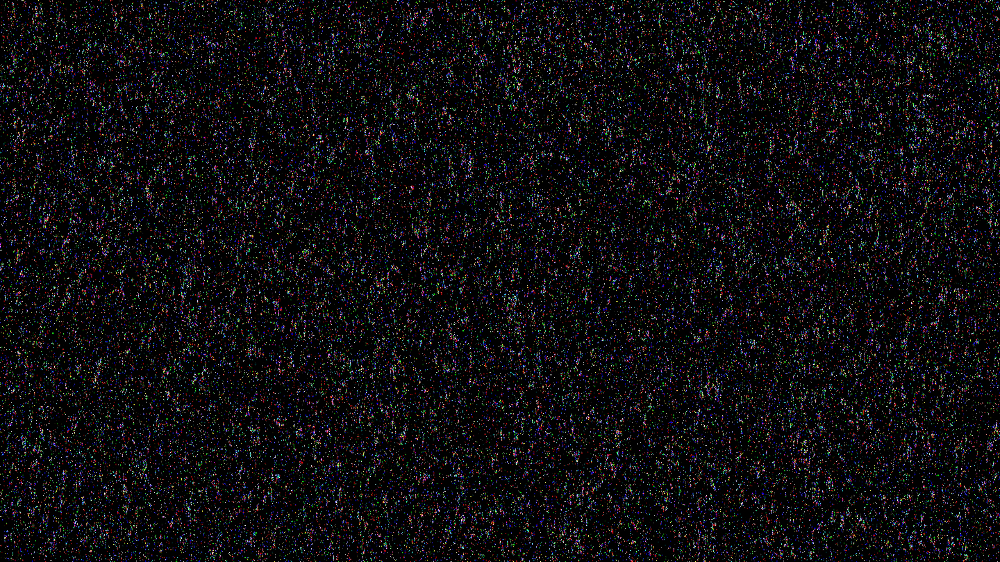

Simply clone the repo and then run with `cargo run --release`. It might take a while to build. If it takes too long you can remove the `[profile.release]` section in the `cargo.toml` file.

Keep in mind this will only work properly if your monitor has the right [subpixel geometry](https://geometrian.com/resources/subpixelzoo/).

Here is a screenshot of it running on my computer (2560x1440 pixels or 11,059,200 cells). Note that if you zoom in it will look wrong. That's because the subpixels only work when aligned exactly with the subpixels on your monitor.

